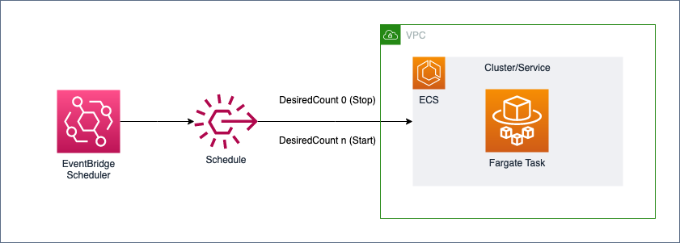
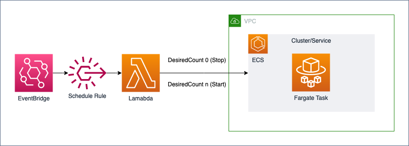

# Schedule ECS Fargate Tasks to stop and start with Amazon EventBridge Rule.

This is a simple CloudFormation that sets up stopping and starting of an existing ECS service by a schedule for specified tasks.

We have confirmed operation in the following environments
- ECS(Fargate type) 

&nbsp;

# AWS EventBridge Scheduler (Recommend)

List of resources to be created
- AWS EventBridge Scheduler
- IAM Role for EventBridge Scheduler

## Setup
Extract eventbridge-scheduler.yaml from the AWS Management Console or AWS CLI.

Parameters
- NamePrefix: Prefix
- EcsClusterName: ECS cluster name
- EcsServiceName: ECS service name
- ScheduleExpressionTimezone: Time Zone
- StopScheduleExpression: CRON expression specifying the time to stop
- StartScheduleExpression: CRON expression for time to start
- StopDesiredCount: number specified for DesiredCount to stop (stop=0)
- StartDesiredCount: number specified for DesiredCount to starting

[Time Zone] &nbsp;
https://en.wikipedia.org/wiki/List_of_tz_database_time_zones

[AWS EventBridge Scheduler Using universal targets] &nbsp;
https://docs.aws.amazon.com/scheduler/latest/UserGuide/managing-targets-universal.html#supported-universal-targets

&nbsp;

# AWS EventBridge Rule and Lambda (Old)

List of resources to be created
- AWS Event Rule
- AWS Lambda(and permission)
- IAM Role for Lambda

## Setup
Extract events-rule.yaml from the AWS Management Console or AWS CLI.

Parameters
- NamePrefix: Prefix
- EcsClusterName: ECS cluster name
- EcsServiceName: ECS service name
- EcsClusterArn: ECS cluster ARN
- StopScheduleExpression: CRON expression specifying the time to stop (UTC)
- StartScheduleExpression: CRON expression for time to start (UTC)
- StopDesiredCount: number specified for DesiredCount to stop (stop=0)
- StartDesiredCount: number specified for DesiredCount to starting

[Schedule Expressions for Rules] &nbsp;
https://docs.aws.amazon.com/AmazonCloudWatch/latest/events/ScheduledEvents.html

